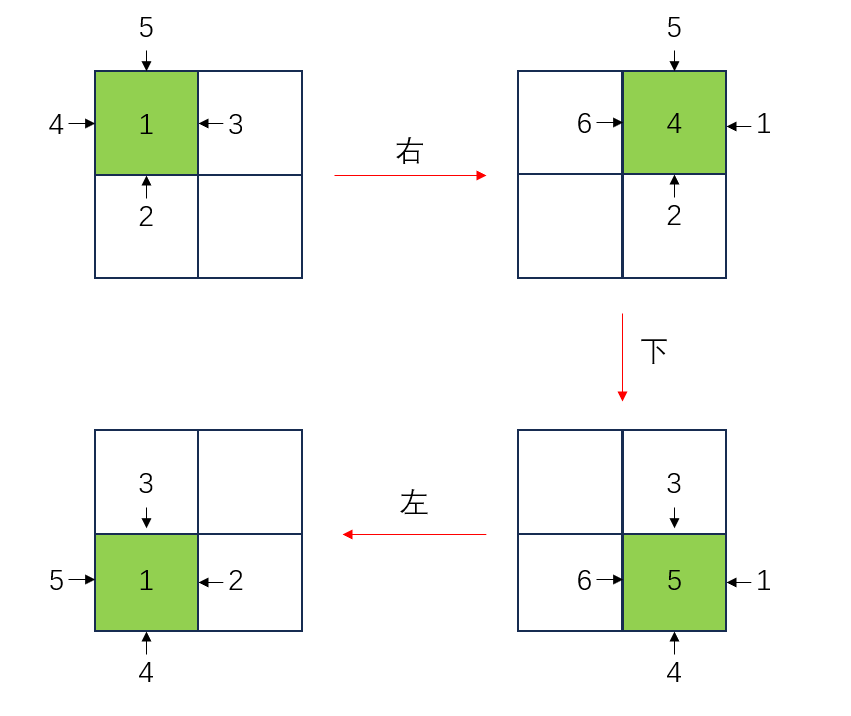

#### dice

考察如下三次骰子滚动的操作，其中绿色格子表示有骰子，格子上的数字是骰子顶面的数字而不是格子上写下的数字：

由于我们只关心底面的数字，我们可以认为只要有 $2 \times 2$ 的空间，就可以让骰子在这个空间里进行任意的平移（实际上还会转一下但无所谓）。因为 $n,m \ge 2$ 而且初始 6 在底面，所以可以直接让骰子平移到所有位置并在对应格子写下 6。显然没有更优方案，故输出 $6 \times n \times m$。